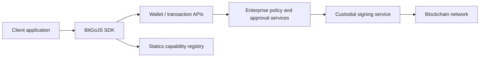

# BitGo regulated custody design

**Status:** Proposed
**Owner:** Wallet Core India
**Ticket:** WCI-1619

## Problem

The SDK supports custodial wallets, self-custody wallets, self-managed cold
wallets, and jurisdiction-specific custody capabilities. Those concerns are
currently easy to conflate because they share wallet and transaction APIs.
The custody boundary must be explicit before adding more regulated entities,
MPC versions, or chain-specific transaction flows.

This document defines the boundary for a BitGo-regulated custody wallet. It is
an engineering design, not a legal determination of whether a product or
entity is regulated.

## Goals

- Keep regulated-custody policy and key control on BitGo services.
- Keep the SDK useful for wallet creation, transaction preparation, and
  transaction request submission without handling custodial private material.
- Represent asset and jurisdiction eligibility from the existing statics
  feature model.
- Preserve one observable transaction lifecycle across TSS and non-TSS custody
  wallets: request, policy/approval processing, signing, and broadcast.
- Make every state-changing request traceable with the existing request ID and
  transaction-request identifiers.

## Non-goals

- Selecting a legal custodian or making a regulatory determination in the SDK.
- Storing, exporting, decrypting, or reconstructing a custodial private key in
  a client process.
- Replacing enterprise policy, compliance, approval, or transaction-monitoring
  services with SDK logic.
- Adding a new custody jurisdiction or enabling custody for an asset. Those
  changes require the relevant product, compliance, and statics decisions.

## Existing implementation boundary

The design follows the current BitGoJS behavior:

- `GenerateWalletOptions.type = 'custodial'` selects custody ownership. TSS
  custody additionally requires `enterprise` and a coin that supports TSS.
- `Wallets.generateWallet` routes TSS custodial wallets to
  `generateCustodialMpcWallet`. The SDK fetches the enterprise's TSS settings,
  applies `custodialMultiSigTypeVersion` for ECDSA EVM wallet-version selection,
  and sends `type: 'custodial'` to `/wallet/add`.
- The wallet-add response supplies key IDs. The SDK returns keychain metadata
  (`source` and `type`) only; it does not receive custodial private keys.
- TSS transaction signing uses a transaction request ID and the signing
  service. The SDK does not perform a local TSS signing round for a custodial
  wallet.
- Non-TSS custodial transaction paths use the initiate endpoint so BitGo can
  apply its server-side signing and approval flow.
- Asset and jurisdiction eligibility is represented by `CoinFeature.CUSTODY`
  and `CoinFeature.CUSTODY_BITGO_*` features. The SDK can report capability;
  the service remains authoritative for the selected custody entity and the
  current account's eligibility.

Relevant implementation locations:

- `modules/sdk-core/src/bitgo/wallet/iWallets.ts` — wallet-generation
  options and public wallet interface.
- `modules/sdk-core/src/bitgo/wallet/wallets.ts` — custodial wallet creation.
- `modules/sdk-core/src/bitgo/wallet/wallet.ts` — custody transaction routing.
- `modules/sdk-core/src/bitgo/baseCoin/iBaseCoin.ts` — base-coin capability interface used by wallet flows.
- `modules/statics/src/coinFeatures.ts` — jurisdiction feature sets.

## Architecture

### Control plane: wallet creation

1. The caller supplies `label`, `enterprise`, `type: 'custodial'`, and the
   requested multisig type.
2. The SDK rejects combinations that require client-held keys, such as a
   custodial wallet created through an external signer.
3. For custodial TSS, the SDK reads the enterprise-scoped TSS settings and
   applies the configured custodial MPC version. Explicit wallet-version
   overrides remain subject to coin support checks.
4. The SDK sends wallet metadata to `/wallet/add`. No custodial private key,
   passphrase, or external-signer callback crosses this boundary.
5. The service returns the wallet and key IDs. The SDK exposes those IDs as
   metadata for compatibility with existing wallet APIs.

### Data plane: transaction lifecycle

#### TSS custodial wallet

1. The SDK requests a transaction build and receives a transaction request.
2. Enterprise policy and approval services evaluate the request. The SDK does
   not duplicate those decisions.
3. The custodial signing service produces the required signature shares and
   returns the request to the transaction service.
4. The SDK submits the transaction request for completion and returns the
   service result, pending approval, or failure.

The transaction request ID is the correlation key across these steps. It must
be preserved across retries and never replaced with a client-generated
transaction identifier.

#### Non-TSS custodial wallet

1. The SDK requests a transaction build.
2. The SDK sends the build parameters to the initiate endpoint.
3. The service applies policy and signs with the custodial key before
   broadcasting or returning a pending approval.

The SDK must not fall back from a custodial path to local signing when a
custodial endpoint fails. Such a fallback could bypass the custody control
boundary.

## Capability and jurisdiction model

The statics feature model answers **whether an asset is configured as eligible
for a capability**. It does not answer **which entity should custody a
specific account**.

For a new regulated custody entity or asset:

1. Add or update the appropriate `CoinFeature.CUSTODY_BITGO_*` capability only
   after the compliance/product decision is complete.
2. Keep the generic `CUSTODY` feature and jurisdiction-specific feature in
   sync with the existing coin-family conventions.
3. Add focused statics tests for inclusion and exclusion. In particular, an
   excluded jurisdiction must not be reintroduced through a token's default
   feature list.
4. Allow the service to perform the final enterprise, geography, product, and
   account eligibility check. A client-side feature check is advisory and
   cannot authorize custody.

`BITGO_CUSTODY_JURISDICTIONS` is a useful SDK inventory for filtering and
presentation. It must not be treated as an authorization list.

## Security and audit invariants

The implementation and future extensions must preserve these invariants:

1. **No custodial secret material in SDK memory.** Custodial key IDs and public
   metadata are acceptable; private keys, shares, passphrases, and recovery
   material are not.
2. **No implicit custody downgrade.** A missing TSS setting, unsupported coin,
   policy denial, or signing-service failure is an error. It must not switch
   to a hot, cold, or local-signing path.
3. **Enterprise scoping is mandatory.** Custodial TSS creation and all policy
   checks must remain associated with the requested enterprise.
4. **Request correlation is retained.** Request tracer IDs and transaction
   request IDs must be passed through every SDK call that can change custody
   state or initiate a transaction.
5. **Capability is not authorization.** SDK statics can prevent obviously
   unsupported requests; the service is the source of truth for eligibility.
6. **Approval state is observable.** A pending approval is returned as a
   pending state, not represented as a successful broadcast.
7. **Replay behavior is explicit.** Retries must reuse the existing transaction
   request where the service supports it. A new transaction request must not
   be created merely because a client request timed out.

## Failure handling

| Failure | SDK behavior | Must not happen |
| --- | --- | --- |
| Missing enterprise | Reject before custodial TSS creation | Create an unscoped wallet |
| Unsupported TSS/MPC version | Return the service or capability error | Silently select a different signing protocol |
| TSS settings unavailable | Fail wallet creation | Guess a wallet version |
| Policy rejection | Return the rejection/pending-approval result | Retry around policy |
| Signing service unavailable | Return a retriable service error | Sign locally or use another key source |
| Broadcast timeout after submission | Preserve the transaction request ID | Create a second request without reconciliation |
| Asset lacks required custody feature | Reject the client-side request when determinable | Present the asset as eligible |

## Rollout plan

1. **Document and review.** Confirm the custody boundary and ownership of
   service-side policy, signing, and audit records.
2. **Contract inventory.** Enumerate wallet creation, transaction request,
   pending approval, broadcast, recovery, and token-enable flows for each
   supported custody wallet type.
3. **Contract tests.** Add or extend tests at the SDK boundary to prove that
   custodial creation never sends client key material, TSS requests preserve
   the transaction request ID, and failures do not fall back to local signing.
4. **Entity/asset rollout.** Add new jurisdiction or asset capabilities as
   isolated statics changes with inclusion and exclusion tests.
5. **Operational validation.** Verify audit correlation and reconciliation in a
   non-production environment before enabling the new path for production
   enterprises.

## Open decisions

- Which service owns the canonical custody-entity identifier returned to
  clients, and should the SDK surface it as typed wallet metadata?
- Which transaction-request statuses and retry guarantees are stable enough to
  publish as an SDK contract?
- Which custody operations need a separate audit-event API instead of relying on
  transaction and request tracing?
- Which recovery and emergency operations are permitted for each regulated
  entity, and how are those permissions represented without exposing key
  material?

These decisions should be resolved by the service, compliance, and product
owners before adding new public SDK types. The current design intentionally
keeps the SDK contract narrow while preserving the existing custodial wallet
behavior.
