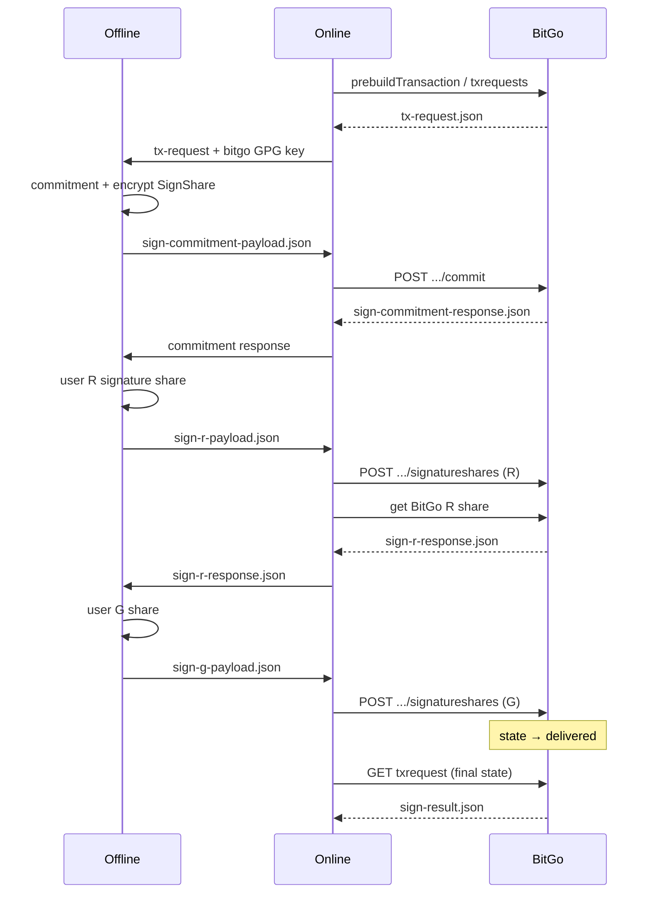

# EdDSA TSS Self-Custody: Sign Transaction — Two-Script Flow (Offline / Online)

> **Overview:** See [examples/js/self-custody-eddsa/README.md](../../../js/self-custody-eddsa/README.md) for the full script inventory, env vars, troubleshooting, and file-transfer guide.

This guide describes **signing a transaction** for an **EdDSA TSS self-custody wallet** (e.g. `tsol`, `tapt`, `tsui`) using two scripts: an **offline script** that holds your encrypted signing material and produces commitment/R/G shares, and an **online script** that talks to BitGo APIs. The flow matches [BitGo's self-custody MPC hot wallet (manual) withdraw guide](https://developers.bitgo.com/docs/withdraw-wallet-type-self-custody-mpc-hot-manual) and the EdDSA signing path in `@bitgo/sdk-core` (`EddsaUtils.signTxRequest` / `signEddsaTssUsingExternalSigner`).

**Note:** This is **EdDSA MPCv1 TSS**, not ECDSA MPCv2 (DKLS). For ECDSA MPCv2, use `examples/js/self-custody-mcp-v2/mpc-self-custody-sign-*.js`.

## Overview

- **EdDSA signing** uses commitment exchange, then **R-share** and **G-share** rounds between user and BitGo (2-of-3 threshold; backup share is not used in this flow).
- **Offline script** (`eddsa-self-custody-sign-offline.js`): decrypts `encryptedPrv` locally, builds commitment/R/G material; writes only safe payloads for the online machine.
- **Online script** (`eddsa-self-custody-sign-online.js`): creates TxRequest, `POST .../commit`, submits signature shares; step 3 submits the G share and fetches the finalized TxRequest (BitGo auto-delivers on G share — no separate `send` call, unlike ECDSA MPCv2).
- **Workspace**: `examples/js/self-custody-eddsa/eddsa-sign-workspace/` (or set `EDDSA_SIGN_WORKSPACE_DIR`).

## Prerequisites

- EdDSA TSS wallet (e.g. from `examples/js/create-tss-wallet.js` with `multisigType: 'tss'` and an EdDSA coin like `tsol`).
- `user-signing-material.json` in the workspace:

```json
{ "encryptedPrv": "<userKeychain.encryptedPrv from wallet creation>" }
```

- Wallet funded with enough balance for amount + fees.
- `BITGO_ACCESS_TOKEN`, `WALLET_ID`, `WALLET_PASSPHRASE`, `COIN`, `RECIPIENT_ADDRESS`, `AMOUNT`.

## Sequence (7 steps)

| # | Machine | Script | Output |
|---|---------|--------|--------|
| 0 | Online | `eddsa-self-custody-sign-online.js --step 0` | `tx-request.json`, `bitgo-gpg-public-key.json` |
| 1 | Offline | `eddsa-self-custody-sign-offline.js --step 1` | `sign-commitment-payload.json`, `sign-eddsa-state.json` |
| 2 | Online | `eddsa-self-custody-sign-online.js --step 1` | `sign-commitment-response.json` |
| 3 | Offline | `eddsa-self-custody-sign-offline.js --step 2` | `sign-r-payload.json` |
| 4 | Online | `eddsa-self-custody-sign-online.js --step 2` | `sign-r-response.json` |
| 5 | Offline | `eddsa-self-custody-sign-offline.js --step 3` | `sign-g-payload.json` |
| 6 | Online | `eddsa-self-custody-sign-online.js --step 3` | `sign-result.json` |



## Commands (from repo root)

```bash
# ONLINE — step 0
export BITGO_ACCESS_TOKEN=your_token
export COIN=tsol
export WALLET_ID=your_wallet_id
export RECIPIENT_ADDRESS=destination_address
export AMOUNT=500000
export BITGO_ENV=test
# optional: export BITGO_CUSTOM_ROOT_URI=http://localhost:3080

node ./examples/js/self-custody-eddsa/eddsa-self-custody-sign-online.js --step 0
```

Copy `examples/js/self-custody-eddsa/eddsa-sign-workspace/` to the offline machine (or share only the two JSON files above plus `user-signing-material.json`).

```bash
# OFFLINE — step 1
export WALLET_PASSPHRASE=your_passphrase
export COIN=tsol

node ./examples/js/self-custody-eddsa/eddsa-self-custody-sign-offline.js --step 1
```

Copy `sign-commitment-payload.json` to online; keep `sign-eddsa-state.json` on offline only.

```bash
# ONLINE — step 1
node ./examples/js/self-custody-eddsa/eddsa-self-custody-sign-online.js --step 1
```

Copy `sign-commitment-response.json` to offline.

```bash
# OFFLINE — step 2
node ./examples/js/self-custody-eddsa/eddsa-self-custody-sign-offline.js --step 2
```

Copy `sign-r-payload.json` to online.

```bash
# ONLINE — step 2
node ./examples/js/self-custody-eddsa/eddsa-self-custody-sign-online.js --step 2
```

Copy `sign-r-response.json` to offline.

```bash
# OFFLINE — step 3
node ./examples/js/self-custody-eddsa/eddsa-self-custody-sign-offline.js --step 3
```

Copy `sign-g-payload.json` to online.

```bash
# ONLINE — step 3
node ./examples/js/self-custody-eddsa/eddsa-self-custody-sign-online.js --step 3
```

## BitGo API mapping

| Step | BitGo API (full tx request) |
|------|-----------------------------|
| 0 | `wallet.prebuildTransaction` → [Create transaction request](https://developers.bitgo.com/reference/v2wallettxrequestcreate) |
| 1 | `POST /api/v2/wallet/{walletId}/txrequests/{id}/transactions/0/commit` |
| 2 | `POST .../transactions/0/signatureshares` (user R share) |
| 3 | `POST .../transactions/0/signatureshares` (user G share); state becomes `delivered` (no `/send` for EdDSA) |

## Troubleshooting

**`Expected transaction request to be in state pendingDelivery but it is in state delivered`** on online step 3: the G share was already accepted and the tx is finalized. Re-run step 3 with the updated script (it fetches the TxRequest instead of calling `/send`). The transaction may already be broadcast — check the wallet in BitGo UI or `sign-result.json` after re-run.

See also:

- [Withdraw - Self-Custody MPC Hot (Manual)](https://developers.bitgo.com/docs/withdraw-wallet-type-self-custody-mpc-hot-manual)
- [Create a signature share](https://developers.bitgo.com/reference/v2wallettxrequestsignaturesharecreate)
- [Sign MPC transaction (Express)](https://developers.bitgo.com/reference/expresswalletsigntxtss) — simpler single-host flow if you do not need air-gapped signing

## Security notes

- **`sign-eddsa-state.json`** contains passphrase-encrypted User SignShare; keep on offline machine only.
- **`user-signing-material.json`** is your encrypted TSS signing material; never copy to the online machine if you require strict self-custody.
- Payload files (`sign-commitment-payload.json`, `sign-r-payload.json`, `sign-g-payload.json`) contain only shares safe to transfer (no raw `encryptedPrv`).

## Related examples

- Create wallet: `examples/js/create-tss-wallet.js`
- ECDSA MPCv2 sign: `examples/docs/self-custody/mpc/sign-transaction-mpcv2-script.md`
- Terminology: `examples/docs/self-custody/mpc/terminology-guide.md`
