# MPCv2 Self-Custody: Sign Transaction — Two-Script Flow (Offline / Online)

This guide describes **signing a transaction** for an **MPCv2 TSS self-custody wallet** using **two separate scripts**: an **offline script** (no network) that produces signature shares from your key material, and an **online script** that sends those shares to BitGo and finalizes the transaction. Raw key material never leaves the offline environment.

## Overview

- **MPCv2 signing** uses a 3-round **DSG (Distributed Signing Generation)** protocol. User and BitGo participate (2-of-3 threshold); the user’s key share stays offline.
- **Offline script** (`mpc-self-custody-sign-offline.js`): Runs on an air-gapped or offline machine. Reads the **transaction request** and your **encrypted user key** (from keychain creation); produces **signature shares** for each round — they are the only data sent out.
- **Online script** (`mpc-self-custody-sign-online.js`): Runs on a network-connected machine. Creates the **TxRequest** (unsigned transaction), sends signature shares to BitGo for each round, then finalizes the transaction.
- **Workspace files**: JSON files exchanged between offline and online machines (tx request, round payloads/responses/state, sign result).

Communication between the two scripts is **file-based** in a shared workspace directory (e.g. `mpc-sign-workspace/` or the same as keygen). In production, run the offline script on an air-gapped machine and copy only the payload/response files.

## Sequence Diagram (Offline ↔ Online ↔ BitGo)

```mermaid
sequenceDiagram
    autonumber
    participant Offline as Offline (keys, no network)
    participant Online as Online (proxy / networked)
    participant BitGo as BitGo API

    Note over Offline,BitGo: Offline never communicates directly with BitGo

    rect rgb(14, 37, 57)
        Note over Online,BitGo: Step 0 — Create TxRequest
        Online->>+BitGo: POST /wallet/.../txrequests (intent)
        BitGo-->>-Online: TxRequest (txRequestId, unsignedTx)
        Online->>Offline: Transfer tx-request.json
    end

    rect rgb(255, 248, 240)
        Note over Offline: Step 1 — DSG round 1 (local)
        Offline->>Offline: Dsg.init, getSignatureShareRound1
        Offline->>Online: sign-round1-payload.json
        Online->>+BitGo: POST .../transactions/0/sign (R1)
        BitGo-->>-Online: TxRequest (R1 response)
        Online->>Offline: sign-round1-response.json
    end

    rect rgb(24, 75, 24)
        Note over Offline: Step 2 — DSG round 2 (local)
        Offline->>Offline: handleIncomingMessages R1, getSignatureShareRound2
        Offline->>Online: sign-round2-payload.json
        Online->>+BitGo: POST .../sign (R2)
        BitGo-->>-Online: TxRequest (R2 response)
        Online->>Offline: sign-round2-response.json
    end

    rect rgb(72, 23, 72)
        Note over Offline: Step 3 — DSG round 3 (local)
        Offline->>Offline: handleIncomingMessages R2, getSignatureShareRound3
        Offline->>Online: sign-round3-payload.json
        Online->>+BitGo: POST .../sign (R3)
        BitGo-->>-Online: TxRequest (R3 response)
        Online->>+BitGo: POST .../txrequests/.../send (finalize)
        BitGo-->>-Online: sign-result.json (signed tx)
    end
```



## Workspace Files

| File | Written by | Read by | Description |
|------|------------|---------|-------------|
| `tx-request.json` | Online (step 0) | Offline (step 1) | Full TxRequest (txRequestId, walletId, unsignedTx with signableHex, derivationPath). |
| `bitgo-gpg-public-key.json` | Online (step 0) or keygen | Offline (steps 2, 3) | BitGo public GPG key (armored). Can reuse from keygen workspace. |
| `sign-round1-payload.json` | Offline (step 1) | Online (step 1) | Signature share round 1 + user GPG public key. |
| `sign-round1-response.json` | Online (step 1) | Offline (step 2) | BitGo response (TxRequest with R1 signature shares). |
| `sign-round1-state.json` | Offline (step 1) | Offline (step 2) | **Sensitive.** Encrypted DSG session and user GPG private key; offline only. |
| `sign-round2-payload.json` | Offline (step 2) | Online (step 2) | Signature share round 2. |
| `sign-round2-response.json` | Online (step 2) | Offline (step 3) | BitGo response (TxRequest with R2 signature shares). |
| `sign-round2-state.json` | Offline (step 2) | Offline (step 3) | **Sensitive.** Encrypted DSG session; offline only. |
| `sign-round3-payload.json` | Offline (step 3) | Online (step 3) | Signature share round 3. |
| `sign-result.json` | Online (step 3) | User | Final TxRequest or signed transaction result. |

Set `MPC_WORKSPACE_DIR` (or `MPC_SIGN_WORKSPACE_DIR` if using a separate signing schema) to use a custom workspace path.

## Steps (Order of Execution)

1. **Online step 0** (machine with network): Create TxRequest via `wallet.prebuildTransaction(...)` (or `prebuildTxWithIntent`); write `tx-request.json`. Optionally fetch BitGo GPG public key → `bitgo-gpg-public-key.json` (or reuse from keygen). Copy `tx-request.json` (and `bitgo-gpg-public-key.json` if needed) to the offline machine.
2. **Offline step 1**: Read `tx-request.json`, encrypted user key (from `keychain-payloads.json` or env/file), and passphrase; run DSG round 1; write `sign-round1-payload.json` and `sign-round1-state.json`. Copy `sign-round1-payload.json` to the online machine.
3. **Online step 1**: Read `sign-round1-payload.json`; POST signature share R1 to BitGo; write `sign-round1-response.json`. Copy `sign-round1-response.json` to the offline machine.
4. **Offline step 2**: Read `sign-round1-response.json`, `sign-round1-state.json`, and BitGo GPG public key; run DSG round 2; write `sign-round2-payload.json` and `sign-round2-state.json`. Copy `sign-round2-payload.json` to the online machine.
5. **Online step 2**: Read `sign-round2-payload.json`; POST R2; write `sign-round2-response.json`. Copy `sign-round2-response.json` to the offline machine.
6. **Offline step 3**: Read `sign-round2-response.json`, `sign-round2-state.json`, and BitGo GPG public key; run DSG round 3; write `sign-round3-payload.json`. Copy `sign-round3-payload.json` to the online machine.
7. **Online step 3**: Read `sign-round3-payload.json`; POST R3; call `sendTxRequest` to finalize; write `sign-result.json`.

## Environment Variables

- **Offline**: `WALLET_PASSPHRASE` (required), `MPC_WORKSPACE_DIR` or `MPC_SIGN_WORKSPACE_DIR` (optional), `COIN` (e.g. `teth`) for hash function. Encrypted user key: from `keychain-payloads.json` (userKeychainParams.encryptedPrv) in workspace or from a separate file/env.
- **Online**: `BITGO_ACCESS_TOKEN` (required), `COIN` (e.g. `teth`), `WALLET_ID`, `MPC_WORKSPACE_DIR` or `MPC_SIGN_WORKSPACE_DIR` (optional), `BITGO_ENV` (e.g. `test`), `BITGO_CUSTOM_ROOT_URI` (optional). Tx params: e.g. `RECIPIENT_ADDRESS`, `AMOUNT` (or pass via file) for building the TxRequest in step 0.

## Commands (from repo root)

```bash
# Online machine (with network)
export BITGO_ACCESS_TOKEN=your_token
export COIN=teth
export WALLET_ID=your_mpcv2_wallet_id
export RECIPIENT_ADDRESS=0x...
export AMOUNT=1000000000000000
# Optional: same workspace as keygen, or set MPC_SIGN_WORKSPACE_DIR
export MPC_WORKSPACE_DIR=./examples/js/self-custody-mcp-v2/mpc-sign-workspace

node ./examples/js/self-custody-mcp-v2/mpc-self-custody-sign-online.js --step 0
# Copy tx-request.json (and bitgo-gpg-public-key.json if needed) to offline machine

# Offline machine (no network)
export WALLET_PASSPHRASE=your_passphrase
export COIN=teth
# Ensure keychain-payloads.json (or user encrypted key) and tx-request.json are in workspace

node ./examples/js/self-custody-mcp-v2/mpc-self-custody-sign-offline.js --step 1
# Copy sign-round1-payload.json to online machine

node ./examples/js/self-custody-mcp-v2/mpc-self-custody-sign-online.js --step 1
# Copy sign-round1-response.json to offline machine

node ./examples/js/self-custody-mcp-v2/mpc-self-custody-sign-offline.js --step 2
# Copy sign-round2-payload.json to online machine

node ./examples/js/self-custody-mcp-v2/mpc-self-custody-sign-online.js --step 2
# Copy sign-round2-response.json to offline machine

node ./examples/js/self-custody-mcp-v2/mpc-self-custody-sign-offline.js --step 3
# Copy sign-round3-payload.json to online machine

node ./examples/js/self-custody-mcp-v2/mpc-self-custody-sign-online.js --step 3
# sign-result.json contains the finalized transaction
```

## Step-by-Step Flow

### Step 0: Create TxRequest (Online)

**Script:** `mpc-self-custody-sign-online.js --step 0`

**What it does:**
- Optionally fetches BitGo GPG public key and writes `bitgo-gpg-public-key.json` (or reuses from keygen workspace).
- Builds the transaction intent (recipients, amount, etc.) and calls `wallet.prebuildTransaction(...)` (TSS wallets use `prebuildTxWithIntent` internally) to create a **TxRequest**.
- Writes the full TxRequest (txRequestId, walletId, unsignedTx with signableHex and derivationPath) to `tx-request.json`.

**API Endpoint:**
- `POST {baseApiUrl}/wallet/{walletId}/txrequests` (with intent)

**Output:** `tx-request.json`, optionally `bitgo-gpg-public-key.json`

**Next:** Transfer `tx-request.json` (and BitGo GPG key if needed) to the offline machine.

---

### Step 1: DSG Round 1 (Offline)

**Script:** `mpc-self-custody-sign-offline.js --step 1`

**What it does:**
- Reads `tx-request.json` and extracts signableHex and derivationPath from the unsigned transaction.
- Decrypts the user key (from `keychain-payloads.json` or env/file) with `WALLET_PASSPHRASE`.
- Computes the message hash (e.g. keccak256 for ETH) and creates a DSG session (`DklsDsg.Dsg`, `init()`).
- Produces signature share round 1 via `getSignatureShareRoundOne`; generates a one-time GPG key pair for this signing session.
- Encrypts the DSG session and user GPG private key with the passphrase (adata = hash:derivationPath) and saves them in state.

**Operations:**
```javascript
const { hashBuffer, derivationPath } = getHashAndDerivationPath(txRequest);
const userKeyShare = Buffer.from(decryptedPrv, 'base64');
const userSigner = new DklsDsg.Dsg(userKeyShare, 0, derivationPath, hashBuffer);
const userSignerBroadcastMsg1 = await userSigner.init();
const signatureShareRound1 = await getSignatureShareRoundOne(userSignerBroadcastMsg1, userGpgKey);
const encryptedRound1Session = bitgo.encrypt({ input: session, password: walletPassphrase, adata });
```

**Output:** `sign-round1-payload.json` (signatureShareRound1, userGpgPubKey), `sign-round1-state.json` (encryptedRound1Session, encryptedUserGpgPrvKey)

**Next:** Transfer `sign-round1-payload.json` to the online machine.

---

### Step 1: Send Signature Share R1 (Online)

**Script:** `mpc-self-custody-sign-online.js --step 1`

**What it does:**
- Reads `sign-round1-payload.json` and `tx-request.json` (for walletId, txRequestId).
- POSTs the signature share to BitGo (`sendSignatureShareV2`: POST `/wallet/{walletId}/txrequests/{txRequestId}/transactions/0/sign`, type `ecdsaMpcV2`).
- Writes the returned TxRequest (including BitGo’s R1 signature share) to `sign-round1-response.json`.

**API Endpoint:**
- `POST {baseApiUrl}/wallet/{walletId}/txrequests/{txRequestId}/transactions/0/sign`
  - Body: `{ type: 'ecdsaMpcV2', signatureShares, signerGpgPublicKey }`

**Output:** `sign-round1-response.json`

**Next:** Transfer `sign-round1-response.json` to the offline machine.

---

### Step 2: DSG Round 2 (Offline)

**Script:** `mpc-self-custody-sign-offline.js --step 2`

**What it does:**
- Restores DSG session and user GPG key from `sign-round1-state.json` (decrypt with passphrase).
- Verifies and parses BitGo’s R1 response from `sign-round1-response.json` (`verifyBitGoMessagesAndSignaturesRoundOne`).
- Runs `handleIncomingMessages` for BitGo’s broadcast, then for BitGo’s P2P messages, to produce user→BitGo messages for round 2 and 3.
- Builds signature share round 2 via `getSignatureShareRoundTwo`; encrypts and saves the new session state.

**Operations:**
```javascript
const round1Session = bitgo.decrypt({ input: encryptedRound1Session, password: walletPassphrase });
await userSigner.setSession(round1Session);
const userToBitGoMessagesRound2 = userSigner.handleIncomingMessages({
  p2pMessages: [],
  broadcastMessages: deserializedMessages.broadcastMessages,
});
const userToBitGoMessagesRound3 = userSigner.handleIncomingMessages({
  p2pMessages: deserializedMessages.p2pMessages,
  broadcastMessages: [],
});
const signatureShareRound2 = await getSignatureShareRoundTwo(
  userToBitGoMessagesRound2,
  userToBitGoMessagesRound3,
  userGpgKey,
  bitgoGpgKey
);
```

**Output:** `sign-round2-payload.json`, `sign-round2-state.json`

**Next:** Transfer `sign-round2-payload.json` to the online machine.

---

### Step 2: Send Signature Share R2 (Online)

**Script:** `mpc-self-custody-sign-online.js --step 2`

**What it does:**
- Reads `sign-round2-payload.json`; POSTs signature share R2 to BitGo.
- Writes the TxRequest (with R2 signature shares) to `sign-round2-response.json`.

**API Endpoint:** Same as step 1, with R2 signature share.

**Output:** `sign-round2-response.json`

**Next:** Transfer `sign-round2-response.json` to the offline machine.

---

### Step 3: DSG Round 3 (Offline)

**Script:** `mpc-self-custody-sign-offline.js --step 3`

**What it does:**
- Restores DSG session from `sign-round2-state.json`.
- Verifies and parses BitGo’s R2 response (`verifyBitGoMessagesAndSignaturesRoundTwo`) to get BitGo’s R3 P2P messages.
- Runs `handleIncomingMessages` for those P2P messages to produce user→BitGo round 4 (final) messages.
- Builds signature share round 3 via `getSignatureShareRoundThree`.

**Operations:**
```javascript
const userToBitGoMessagesRound4 = userSigner.handleIncomingMessages({
  p2pMessages: deserializedBitGoToUserMessagesRound3.p2pMessages,
  broadcastMessages: [],
});
const signatureShareRound3 = await getSignatureShareRoundThree(
  userToBitGoMessagesRound4,
  userGpgKey,
  bitgoGpgKey
);
```

**Output:** `sign-round3-payload.json`

**Next:** Transfer `sign-round3-payload.json` to the online machine.

---

### Step 3: Send Signature Share R3 and Finalize (Online)

**Script:** `mpc-self-custody-sign-online.js --step 3`

**What it does:**
- Reads `sign-round3-payload.json`; POSTs signature share R3 to BitGo.
- Calls `sendTxRequest` to finalize the transaction (POST `/wallet/{walletId}/txrequests/{txRequestId}/send` or equivalent).
- Writes the result (final TxRequest or signed tx) to `sign-result.json`.

**API Endpoints:**
- `POST .../transactions/0/sign` (R3)
- `POST .../txrequests/.../send` (finalize)

**Output:** `sign-result.json`

**Result:** Transaction is signed and submitted; you can use the result for broadcast or tracking.

## Security Notes

- **Offline script** must never call `bitgo.get()` or `bitgo.post()`; it only reads the TxRequest and BitGo public key from files and uses `bitgo.encrypt()` / `bitgo.decrypt()` locally.
  - Your **decrypted user key share** is only used in memory to produce signature shares; it never leaves the offline machine.
- **State files** (`sign-round1-state.json`, `sign-round2-state.json`) contain passphrase-encrypted session and GPG private key; keep them only on the offline machine.
- **Payload files** (`sign-round1/2/3-payload.json`) contain only signature shares (and public GPG key); safe to transfer to the online machine.
- 2-of-3 threshold: signing requires the user (offline) and BitGo (online); the backup key share is not used in this flow unless you configure a different signer set.
