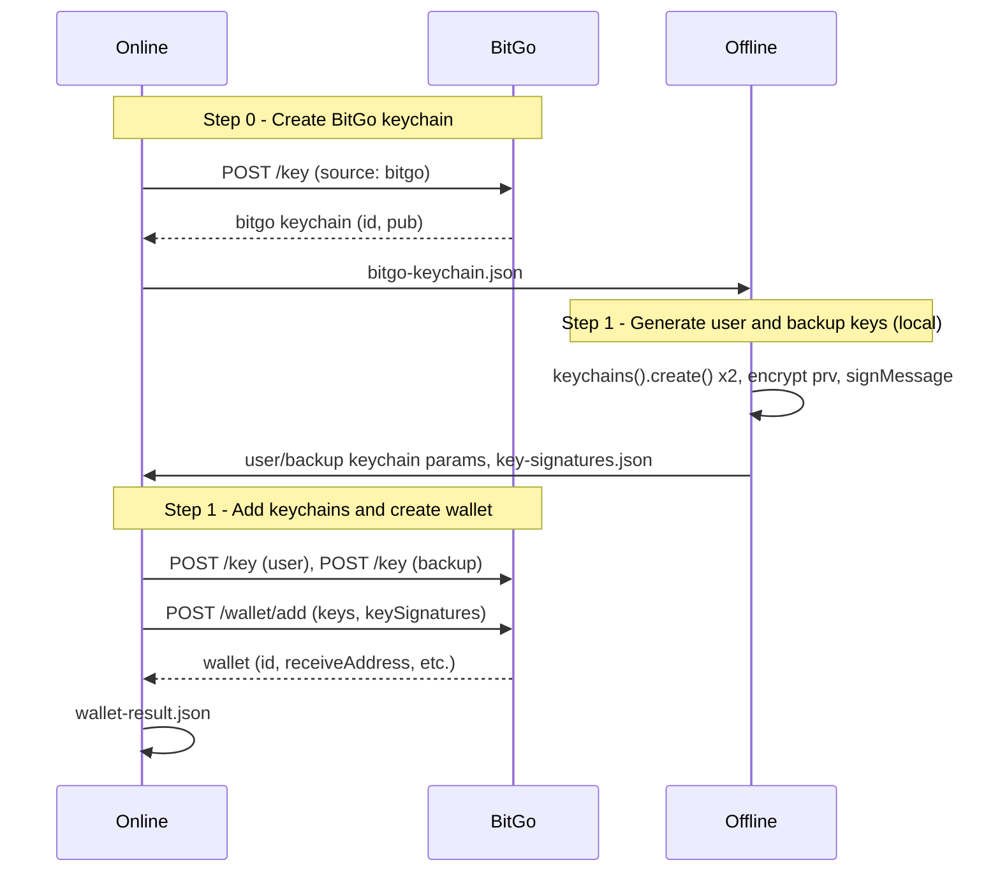

# Multisig Self-Custody Wallet: Two-Script Flow (Offline / Online)

This guide describes creating an **on-chain 2-of-3 multisig self-custody wallet** using **two separate scripts**: an **offline script** that generates user and backup keypairs and key signatures (no network), and an **online script** that creates the BitGo keychain, adds keychains, and creates the wallet. User and backup **private keys** exist only on the offline machine; **encryptedPrv is never sent to BitGo** — only public keys and key signatures are sent.

## Overview

- **On-chain multisig** is 2-of-3 with three **full keypairs** (public + private). User and backup each hold one private key locally; BitGo holds the third. This is **not** TSS/MPC (no key shares).
- **Offline script** (`multisig-self-custody-offline.js`): Runs on an air-gapped or offline machine. Creates user and backup keypairs, encrypts private keys with a passphrase, and signs backup and BitGo public keys with the user key to produce **key signatures**. Only `pub` and `source` are written to the params files that are copied to online; **encryptedPrv is never sent to BitGo**. Encrypted keys are written to `local-encrypted-keys.json` (keep offline; use for local signing).
- **Online script** (`multisig-self-custody-online.js`): Runs on a network-connected machine. Step 0: creates BitGo keychain and writes `bitgo-keychain.json`. Step 1: adds user and backup keychains (pub + source only), then POSTs to create the wallet with keys and keySignatures.
- **Workspace**: A directory of JSON files exchanged between offline and online. Keychain params contain only pub + source; encrypted keys stay in `local-encrypted-keys.json` on the offline machine.

## Sequence Diagram



## Workspace Files

| File | Written by | Read by | Description |
|------|------------|---------|-------------|
| `bitgo-keychain.json` | Online (step 0) | Offline (step 1) | BitGo keychain: `id`, `pub`. |
| `user-keychain-params.json` | Offline (step 1) | Online (step 1) | User keychain params: `pub`, `source: 'user'` (no encryptedPrv). |
| `backup-keychain-params.json` | Offline (step 1) | Online (step 1) | Backup keychain params: `pub`, `source: 'backup'` (no encryptedPrv). |
| `key-signatures.json` | Offline (step 1) | Online (step 1) | Key signatures: `backup`, `bitgo` (hex). User signs backup.pub and bitgo.pub. |
| `local-encrypted-keys.json` | Offline (step 1) | — | **Offline only.** Encrypted user/backup keys for local signing; do not copy to online. |
| `wallet-result.json` | Online (step 1) | User | Wallet ID, receive address, keychain IDs. |

Set `MULTISIG_WORKSPACE_DIR` (or `MPC_WORKSPACE_DIR`) to use a custom workspace path; default is `multisig-workspace` inside the script directory.

## Steps (Order of Execution)

1. **Online step 0** (machine with network): Create BitGo keychain via `keychains().createBitGo({ enterprise })`, write `bitgo-keychain.json` (id, pub). Copy this file to the offline machine.
2. **Offline step 1**: Read `bitgo-keychain.json` and `WALLET_PASSPHRASE`. Create user and backup keypairs with `keychains().create()`, encrypt private keys with passphrase, compute key signatures (user signs backup.pub and bitgo.pub). Write `user-keychain-params.json`, `backup-keychain-params.json` (pub + source only; no encryptedPrv), `key-signatures.json`, and `local-encrypted-keys.json` (encrypted keys — keep offline only, use for local signing).
3. **Online step 1**: Read user/backup params and key-signatures. `keychains().add(userKeychainParams)`, `keychains().add(backupKeychainParams)`. Build wallet params (keys, keySignatures, label, m: 2, n: 3), call `supplementGenerateWallet` if needed, POST `/wallet/add`, write `wallet-result.json`.

## Environment Variables

- **Offline**: `WALLET_PASSPHRASE` (required for step 1), `COIN` (e.g. `tbtc`, `teth`), `MULTISIG_WORKSPACE_DIR` (optional).
- **Online**: `BITGO_ACCESS_TOKEN` (required), `COIN` (e.g. `tbtc`, `teth`), `WALLET_LABEL`, `ENTERPRISE` (optional), `BITGO_ENV` (e.g. `test`), `MULTISIG_WORKSPACE_DIR` (optional).

## Commands (from repo root)

```bash
# Online machine (with network)
export BITGO_ACCESS_TOKEN=your_token
export COIN=tbtc
export WALLET_LABEL="My Multisig Wallet"
export ENTERPRISE=optional_enterprise_id

node ./examples/js/self-custody-multisig/multisig-self-custody-online.js --step 0
# Copy bitgo-keychain.json to offline machine.

# Offline machine (no network)
export WALLET_PASSPHRASE=your_passphrase
export COIN=tbtc
node ./examples/js/self-custody-multisig/multisig-self-custody-offline.js --step 1
# Copy user-keychain-params.json, backup-keychain-params.json, key-signatures.json to online machine (do NOT copy local-encrypted-keys.json).

# Online machine
node ./examples/js/self-custody-multisig/multisig-self-custody-online.js --step 1
# wallet-result.json is written; wallet is created.
```

## Step-by-Step Flow

### Online Step 0 — Create BitGo keychain

- **Script**: `multisig-self-custody-online.js --step 0`
- **Input**: Env: `BITGO_ACCESS_TOKEN`, `COIN`, optional `ENTERPRISE`.
- **Operations**: Authenticate BitGo, `baseCoin.keychains().createBitGo({ enterprise })`, write `bitgo-keychain.json` with `id` and `pub`.
- **Output**: `bitgo-keychain.json`
- **API**: `POST /key` with `source: 'bitgo'`.

### Offline Step 1 — Generate user and backup keys, encrypt, key signatures

- **Script**: `multisig-self-custody-offline.js --step 1`
- **Input**: `bitgo-keychain.json`, env: `WALLET_PASSPHRASE`, `COIN`.
- **Operations**: Load BitGo SDK (no token). `baseCoin.keychains().create()` for user and backup (get `pub` + `prv`). `bitgo.encrypt()` for both keys. `baseCoin.signMessage()` for key signatures. Build user params `{ pub, source: 'user' }`, backup params `{ pub, source: 'backup' }` (no encryptedPrv). Write keychain params, key-signatures, and local-encrypted-keys.json (encrypted keys; keep offline).
- **Output**: `user-keychain-params.json`, `backup-keychain-params.json`, `key-signatures.json`, `local-encrypted-keys.json`. No raw `prv` on disk.
- **API**: None (offline).

### Online Step 1 — Add keychains and create wallet

- **Script**: `multisig-self-custody-online.js --step 1`
- **Input**: `user-keychain-params.json`, `backup-keychain-params.json`, `key-signatures.json`, `bitgo-keychain.json`; env: `BITGO_ACCESS_TOKEN`, `COIN`, `WALLET_LABEL`, optional `ENTERPRISE`.
- **Operations**: `keychains().add(userKeychainParams)`, `keychains().add(backupKeychainParams)`. Build `walletParams`: `keys = [userKeychainId, backupKeychainId, bitgoKeychainId]`, `keySignatures`, `label`, `m: 2`, `n: 3`. Call `baseCoin.supplementGenerateWallet(walletParams, keychains)` if needed. `bitgo.post(baseCoin.url('/wallet/add')).send(finalWalletParams).result()`.
- **Output**: `wallet-result.json` (walletId, receiveAddress, keychain IDs).
- **API**: `POST /key` (user), `POST /key` (backup), `POST /wallet/add`.

## Security Notes

- **Encrypted keys never sent to BitGo.** Keychain params contain only `pub` and `source`. Encrypted user/backup keys are stored in `local-encrypted-keys.json` on the offline machine. For spending you must sign from a **local signer** (e.g. BitGo Express with key loaded from that file + passphrase). The 2-of-3 is: your local signer + BitGo key.
- **Offline script never calls the network.** It uses the BitGo SDK only for `bitgo.coin(COIN)`, `baseCoin.keychains().create()`, `bitgo.encrypt()`, and `baseCoin.signMessage()`. No `bitgo.get()` or `bitgo.post()`.
- **Private keys** exist only in memory during the offline step; only passphrase-encrypted keys are written to `local-encrypted-keys.json` (keychain params have no encryptedPrv).
- **Backup** `local-encrypted-keys.json` and your passphrase securely. Loss of both user and backup key material can make the wallet unrecoverable.
- Do not commit the workspace directory; do not copy `local-encrypted-keys.json` to the online machine.

## Coin Support

- `keychains().create()` and `signMessage()` depend on the base coin (e.g. BTC vs ETH). Use `COIN` (e.g. `tbtc`, `teth`, `tsol`) appropriate for your chain. Test with the target coin.
- Key format: add keychain uses `pub` (and optionally `encryptedPrv`; this flow omits it). Format of `pub` (xpub vs address) is determined by the coin; the script uses the format returned by `baseCoin.keychains().create()`.
- Some coins require extra wallet params (e.g. `walletVersion`). The online script calls `baseCoin.supplementGenerateWallet(walletParams, keychains)` before POST so coin-specific params are included.

## Signing transactions

To spend from a wallet created with this flow, use the **two-script sign flow**: online step 0 builds the transaction and writes `tx-prebuild.json`; the offline script signs with your user or backup key from `local-encrypted-keys.json` and produces `half-signed.json`; online step 1 submits to BitGo. See [Sign transaction (multisig script)](sign-transaction-multisig-script.md).

## Reference

- Implementation: `modules/sdk-core/src/bitgo/wallet/wallets.ts` (`generateWallet`: userKeychainPromise, backupKeychainPromise, createBitGo, keySignatures, supplementGenerateWallet).
- Keychains: `modules/sdk-core/src/bitgo/keychain/keychains.ts` (`create`, `add`, `createBitGo`, `createBackup`).
