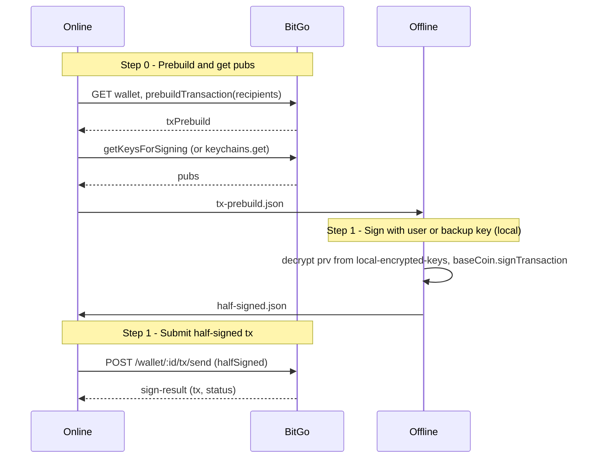

# Multisig Self-Custody: Sign Transaction — Two-Script Flow (Offline / Online)

This guide describes **signing a transaction** for an **on-chain 2-of-3 multisig self-custody wallet** using **two scripts**: an **online script** that builds the transaction and gets public keys, and an **offline script** that signs with your user or backup key from `local-encrypted-keys.json`. The half-signed result is then submitted by the online script. No TSS; a single offline sign step produces the half-signed transaction.

The wallet must have been created with the [multisig wallet creation flow](create-wallet-multisig-script.md) (no `encryptedPrv` at BitGo; keys in `local-encrypted-keys.json`). For terminology, see the [terminology guide](terminology-guide.md).

## Overview

- **On-chain multisig signing**: `wallet.prebuildTransaction(buildParams)` returns **txPrebuild**; signing with your key (user or backup) produces **halfSigned** (or **txHex** for UTXO); `wallet.submitTransaction({ halfSigned })` (or `{ txHex }`) sends to BitGo, which adds the second signature and broadcasts.
- **Online script** (`multisig-sign-online.js`): Step 0 — get wallet, prebuild transaction (recipients from env or file), get keychain pubs, optionally verify; write **tx-prebuild.json**. Step 1 — read **half-signed.json**, submit to BitGo, write **sign-result.json**.
- **Offline script** (`multisig-sign-offline.js`): Reads tx-prebuild.json and local-encrypted-keys.json, decrypts user or backup key with passphrase, calls `baseCoin.signTransaction(...)`, writes **half-signed.json**. No network.
- **Workspace**: Same directory as keygen when possible (so `local-encrypted-keys.json` is present), or a dedicated sign workspace. Files: `tx-prebuild.json`, `half-signed.json`, `sign-result.json`.

## Sequence Diagram



## Workspace Files

| File | Written by | Read by | Description |
|------|------------|---------|-------------|
| `tx-prebuild.json` | Online (step 0) | Offline (step 1) | `{ txPrebuild, walletId, pubs, txParams? }`. |
| `half-signed.json` | Offline (step 1) | Online (step 1) | SignedTransaction: `{ halfSigned: { ... } }` (ETH) or `{ txHex }` (UTXO). |
| `sign-result.json` | Online (step 1) | User | Result from `submitTransaction`. |
| `local-encrypted-keys.json` | Keygen (wallet creation) | Offline (step 1) | **Offline only.** User/backup encrypted keys; keep in same workspace when reusing keygen dir. |

Set `MULTISIG_SIGN_WORKSPACE_DIR` or `MULTISIG_WORKSPACE_DIR` to use a custom workspace path; default is `multisig-workspace` in the script directory.

## Steps (Order of Execution)

1. **Online step 0** (machine with network): Load wallet, call `prebuildTransaction({ recipients })` (recipients from env `RECIPIENT_ADDRESS`/`AMOUNT` or from `tx-params.json`), optionally `verifyTransaction`, get `pubs` via `getKeysForSigning({ wallet })`. Write **tx-prebuild.json** with `txPrebuild`, `walletId`, `pubs` (and optionally `txParams`). Copy tx-prebuild.json to the offline machine.
2. **Offline step 1**: Read tx-prebuild.json, local-encrypted-keys.json, and `WALLET_PASSPHRASE`. Choose signer with `SIGNER=user` (default) or `backup`. Decrypt that key, call `baseCoin.signTransaction({ txPrebuild: { ...txPrebuild, walletId }, prv, pubs })`. Write **half-signed.json** (exact return: `{ halfSigned: { ... } }` or `{ txHex }` per coin). Copy half-signed.json to the online machine.
3. **Online step 1**: Read half-signed.json, call `wallet.submitTransaction(params)` (params = file contents). Write **sign-result.json**.

## Environment Variables

- **Offline**: `WALLET_PASSPHRASE` (required), `COIN` (e.g. `tbtc`, `teth`), `SIGNER` (`user` or `backup`, default `user`), `MULTISIG_SIGN_WORKSPACE_DIR` or `MULTISIG_WORKSPACE_DIR` (optional).
- **Online step 0**: `BITGO_ACCESS_TOKEN` (required), `COIN`, `WALLET_ID`, `RECIPIENT_ADDRESS`, `AMOUNT` (or use `tx-params.json` with `recipients`). Optional: `VERIFY_TX=false` to skip verification, `TX_PARAMS_FILE` (default `tx-params.json`), `BITGO_ENV`, `MULTISIG_SIGN_WORKSPACE_DIR`, `MULTISIG_WORKSPACE_DIR`.
- **Online step 1**: `BITGO_ACCESS_TOKEN`, `COIN`; `WALLET_ID` optional if tx-prebuild.json (with `walletId`) is in workspace.

## Commands (from repo root)

```bash
# Online machine (with network)
export BITGO_ACCESS_TOKEN=your_token
export COIN=tbtc
export WALLET_ID=your_multisig_wallet_id
export RECIPIENT_ADDRESS=recipient_address
export AMOUNT=amount_in_base_units

node ./examples/js/self-custody-multisig/multisig-sign-online.js --step 0
# Copy tx-prebuild.json to offline machine (use same workspace dir so offline has local-encrypted-keys.json)

# Offline machine (no network)
export WALLET_PASSPHRASE=your_passphrase
export COIN=tbtc
# SIGNER=user (default) or SIGNER=backup
node ./examples/js/self-custody-multisig/multisig-sign-offline.js
# Copy half-signed.json to online machine

# Online machine
node ./examples/js/self-custody-multisig/multisig-sign-online.js --step 1
# sign-result.json is written
```

## Step-by-Step Flow

### Online Step 0 — Prebuild and get pubs

- **Script**: `multisig-sign-online.js --step 0`
- **Input**: Env: `BITGO_ACCESS_TOKEN`, `COIN`, `WALLET_ID`; recipients from `RECIPIENT_ADDRESS`/`AMOUNT` or from `tx-params.json` (`recipients` array).
- **Operations**: Authenticate BitGo, get wallet, `wallet.prebuildTransaction({ recipients })`, `baseCoin.keychains().getKeysForSigning({ wallet })` → `pubs`. Optionally `baseCoin.verifyTransaction({ txPrebuild, txParams: { recipients }, wallet })`. Write `{ txPrebuild, walletId, pubs, txParams }` to tx-prebuild.json.
- **Output**: `tx-prebuild.json`
- **Next**: Copy tx-prebuild.json to the offline machine (offline machine must also have local-encrypted-keys.json in the same workspace when using the keygen directory).

### Offline Step 1 — Sign with user or backup key

- **Script**: `multisig-sign-offline.js`
- **Input**: tx-prebuild.json, local-encrypted-keys.json, env: `WALLET_PASSPHRASE`, `COIN`, `SIGNER` (user | backup).
- **Operations**: Load BitGo SDK (no token). Read txPrebuild, walletId, pubs. Decrypt `userEncryptedPrv` or `backupEncryptedPrv` with passphrase. `baseCoin.signTransaction({ txPrebuild: { ...txPrebuild, walletId }, prv, pubs })`. Write the exact return value (SignedTransaction) to half-signed.json.
- **Output**: `half-signed.json` (shape is coin-specific: UTXO → `{ txHex }`, ETH → `{ halfSigned: { txHex, recipients, ... } }`).
- **API**: None (offline).

### Online Step 1 — Submit half-signed transaction

- **Script**: `multisig-sign-online.js --step 1`
- **Input**: half-signed.json, tx-prebuild.json (for walletId) or env `WALLET_ID`; env: `BITGO_ACCESS_TOKEN`, `COIN`.
- **Operations**: Get wallet (from walletId in tx-prebuild or env), read half-signed.json, `wallet.submitTransaction(params)` (params = file contents: either `{ txHex }` or `{ halfSigned }`).
- **Output**: `sign-result.json`
- **API**: `POST /wallet/:id/tx/send` (halfSigned or txHex).

## Security Notes

- **Offline script never calls the network.** It only reads tx-prebuild.json and local-encrypted-keys.json, decrypts with the passphrase, signs, and writes half-signed.json. Raw private key exists only in memory.
- **local-encrypted-keys.json** must remain on the offline machine (same as wallet-creation flow). Do not copy it to the online machine.
- **Optional**: In online step 0, call `baseCoin.verifyTransaction({ txPrebuild, txParams: { recipients }, wallet })` before writing tx-prebuild so the offline machine only signs a verified intent. Set `VERIFY_TX=false` to skip.

## Coin Support

- **txPrebuild** and **halfSigned** shape are coin-specific. UTXO: prebuild has `txHex`, `txInfo`, etc.; sign returns `{ txHex }`. ETH: prebuild has `txHex`, `recipients`, `eip1559`, etc.; sign returns `{ halfSigned: { txHex, recipients, eip1559, ... } }`. The scripts use the same SDK interfaces; test with one UTXO (e.g. tbtc) and one ETH (e.g. teth) coin.

## Reference

- Wallet creation: [create-wallet-multisig-script.md](create-wallet-multisig-script.md)
- Terminology: [terminology-guide.md](terminology-guide.md)
- SDK: `wallet.prebuildTransaction`, `wallet.signTransaction`, `wallet.submitTransaction`; `baseCoin.signTransaction`, `baseCoin.keychains().getKeysForSigning`.
