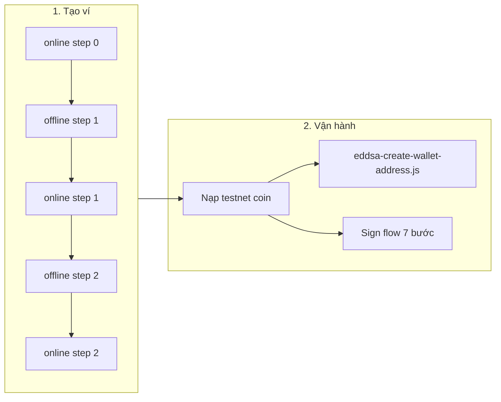

# EdDSA TSS Self-Custody — Hướng dẫn scripts

Thư mục này chứa **ví dụ tách máy offline/online** để tạo ví, tạo địa chỉ nhận và ký giao dịch cho **EdDSA TSS (MPCv1)** trên BitGo — ví dụ coin: `tsol`, `tapt`, `tsui`.

> **Không phải ECDSA MPCv2 (DKLS).** Flow ECDSA nằm ở `examples/js/self-custody-mcp-v2/`.

---

## Tổng quan end-to-end



| Giai đoạn | Script chính | Máy | Chi tiết |
|-----------|--------------|-----|----------|
| Tạo ví | `eddsa-self-custody-online.js` + `eddsa-self-custody-offline.js` | Offline + Online | [create-wallet-eddsa-script.md](../../docs/self-custody/eddsa/create-wallet-eddsa-script.md) |
| Tạo địa chỉ nhận | `eddsa-create-wallet-address.js` | Online only | Mục [Tạo địa chỉ](#tạo-địa-chỉ-nhận) bên dưới |
| Rút / ký tx | `eddsa-self-custody-sign-online.js` + `eddsa-self-custody-sign-offline.js` | Offline + Online | [sign-transaction-eddsa-script.md](../../docs/self-custody/eddsa/sign-transaction-eddsa-script.md) |

---

## Chuẩn bị trước khi chạy

1. **Cài dependency** (từ root repo):

   ```bash
   yarn install
   ```

2. **File `.env`** ở root repo (hoặc export biến môi trường). Các script dùng `require('dotenv').config()`.

3. **BitGo Express** (tuỳ chọn): set `BITGO_CUSTOM_ROOT_URI=http://localhost:3080` nếu không gọi thẳng BitGo API. Express **không** tự chạy — phải start riêng.

4. **Node.js**: repo hỗ trợ `>=20 <25`.

5. **Token & enterprise**: `BITGO_ACCESS_TOKEN`, `ENTERPRISE` (nếu API yêu cầu), `BITGO_ENV=test` cho testnet.

---

## Danh sách file trong thư mục

### Script có thể chạy trực tiếp

| File | Mục đích | Mạng |
|------|----------|------|
| `eddsa-self-custody-online.js` | Tạo ví — bước online (0, 1, 2) | Có |
| `eddsa-self-custody-offline.js` | Tạo ví — bước offline (1, 2) | Không |
| `eddsa-self-custody-sign-online.js` | Ký tx — bước online (0–3) | Có |
| `eddsa-self-custody-sign-offline.js` | Ký tx — bước offline (1–3) | Không |
| `eddsa-create-wallet-address.js` | Tạo địa chỉ nhận mới | Có |

### Module hỗ trợ (không chạy trực tiếp)

| File | Vai trò |
|------|---------|
| `eddsa-keygen-helpers.js` | Logic offline tạo key share, GPG, combine keychain (mirror `EddsaUtils` trong sdk-core) |
| `eddsa-sign-helpers.js` | Logic offline commitment / G-share (gọi `EDDSAMethods` từ sdk-core) |
| `eddsa-keygen-workspace-schema.js` | Tên file + đường dẫn workspace **tạo ví** |
| `eddsa-sign-workspace-schema.js` | Tên file + đường dẫn workspace **ký tx** |
| `../self-custody-mcp-v2/bitgo-auth-utils.js` | Auth Express / v1 token (dùng chung với MPCv2) |

### Thư mục workspace (dữ liệu runtime — **không commit**)

| Thư mục | Dùng cho |
|---------|----------|
| `eddsa-keygen-workspace/` | Tạo ví (mặc định) |
| `eddsa-sign-workspace/` | Ký giao dịch (mặc định) |

Có thể tách nhiều ví / nhiều lần rút bằng biến môi trường:

```bash
export EDDSA_KEYGEN_WORKSPACE_DIR=./examples/js/self-custody-eddsa/eddsa-keygen-workspace/tsol-wallet-1
export EDDSA_SIGN_WORKSPACE_DIR=./examples/js/self-custody-eddsa/eddsa-sign-workspace/tsol-withdrawal-1
```

---

## Flow 1: Tạo ví (5 bước, 2 script)

**Mục tiêu:** User + backup key sinh trên máy offline; BitGo chỉ nhận share đã mã hoá GPG.

```
Online 0 → Offline 1 → Online 1 → Offline 2 → Online 2
```

| Bước | Máy | Lệnh | Output chính |
|------|-----|------|--------------|
| 0 | Online | `eddsa-self-custody-online.js --step 0` | `bitgo-gpg-public-key.json` |
| 1 | Offline | `eddsa-self-custody-offline.js --step 1` | `bitgo-keychain-payload.json`, `eddsa-offline-state.json` |
| 2 | Online | `eddsa-self-custody-online.js --step 1` | `bitgo-keychain-response.json` |
| 3 | Offline | `eddsa-self-custody-offline.js --step 2` | `user-keychain-params.json`, `backup-keychain-params.json`, `user-signing-material.json` |
| 4 | Online | `eddsa-self-custody-online.js --step 2` | `wallet-result.json` |

**Env thường dùng**

| Biến | Bước | Bắt buộc |
|------|------|----------|
| `BITGO_ACCESS_TOKEN` | Online | Có |
| `COIN` | Cả hai | Có (vd. `tsol`) |
| `WALLET_PASSPHRASE` | Offline | Có |
| `ENTERPRISE` | Online | Tuỳ enterprise |
| `WALLET_LABEL` | Online step 2 | Tuỳ chọn |
| `BITGO_ENV` | Online | Mặc định `test` |
| `BITGO_CUSTOM_ROOT_URI` | Online | Tuỳ chọn |

**Ví dụ nhanh (từ root repo):**

```bash
# --- ONLINE step 0 ---
export BITGO_ACCESS_TOKEN=your_token
export COIN=tsol
export BITGO_ENV=test
node ./examples/js/self-custody-eddsa/eddsa-self-custody-online.js --step 0
# Copy bitgo-gpg-public-key.json sang máy offline

# --- OFFLINE step 1 ---
export WALLET_PASSPHRASE=your_passphrase
export COIN=tsol
node ./examples/js/self-custody-eddsa/eddsa-self-custody-offline.js --step 1
# Copy bitgo-keychain-payload.json sang online; GIỮ eddsa-offline-state.json trên offline

# --- ONLINE step 1 ---
node ./examples/js/self-custody-eddsa/eddsa-self-custody-online.js --step 1
# Copy bitgo-keychain-response.json sang offline

# --- OFFLINE step 2 ---
node ./examples/js/self-custody-eddsa/eddsa-self-custody-offline.js --step 2
# Copy user-keychain-params.json + backup-keychain-params.json sang online
# GIỮ user-signing-material.json cho ký tx sau này

# --- ONLINE step 2 ---
export WALLET_LABEL="My EdDSA Wallet"
node ./examples/js/self-custody-eddsa/eddsa-self-custody-online.js --step 2
# → wallet-result.json (walletId, receive address)
```

Chi tiết + bảo mật: [create-wallet-eddsa-script.md](../../docs/self-custody/eddsa/create-wallet-eddsa-script.md)

---

## Tạo địa chỉ nhận

**Chỉ cần online.** Dùng sau khi có `wallet-result.json` hoặc biết `WALLET_ID`.

```bash
export BITGO_ACCESS_TOKEN=your_token
export COIN=tsol
# export WALLET_ID=...   # bỏ qua nếu wallet-result.json nằm trong keygen workspace

node ./examples/js/self-custody-eddsa/eddsa-create-wallet-address.js
```

Output: `address-result.json` trong keygen workspace (hoặc thư mục `EDDSA_KEYGEN_WORKSPACE_DIR`).

---

## Flow 2: Ký giao dịch / rút tiền (7 bước, 2 script)

**Mục tiêu:** Ký EdDSA TSS qua commitment → R-share → G-share; backup share **không** tham gia ký.

```
Online 0 → Offline 1 → Online 1 → Offline 2 → Online 2 → Offline 3 → Online 3
```

| Bước | Máy | Lệnh | Output chính |
|------|-----|------|--------------|
| 0 | Online | `eddsa-self-custody-sign-online.js --step 0` | `tx-request.json`, `bitgo-gpg-public-key.json` |
| 1 | Offline | `eddsa-self-custody-sign-offline.js --step 1` | `sign-commitment-payload.json`, `sign-eddsa-state.json` |
| 2 | Online | `eddsa-self-custody-sign-online.js --step 1` | `sign-commitment-response.json` |
| 3 | Offline | `eddsa-self-custody-sign-offline.js --step 2` | `sign-r-payload.json` |
| 4 | Online | `eddsa-self-custody-sign-online.js --step 2` | `sign-r-response.json` |
| 5 | Offline | `eddsa-self-custody-sign-offline.js --step 3` | `sign-g-payload.json` |
| 6 | Online | `eddsa-self-custody-sign-online.js --step 3` | `sign-result.json` |

**Điều kiện trước step 0**

- Ví đã có **số dư** ≥ `AMOUNT` + phí (lỗi `insufficient balance` = ví trống hoặc `AMOUNT` quá lớn).
- File `user-signing-material.json` trong sign workspace:

  ```json
  { "encryptedPrv": "<từ user-signing-material.json lúc tạo ví>" }
  ```

- Hoặc set `ENCRYPTED_USER_KEY` thay cho file trên (offline).

**Env step 0 (online)**

| Biến | Ví dụ `tsol` |
|------|----------------|
| `WALLET_ID` | Từ `wallet-result.json` |
| `RECIPIENT_ADDRESS` | Địa chỉ đích |
| `AMOUNT` | Lamports: `5000000` = 0.005 SOL; `100000000` = 0.1 SOL |
| `COIN` | `tsol` |

**Lưu ý EdDSA vs ECDSA MPCv2:** Sau khi gửi G-share, BitGo tự chuyển TxRequest sang `delivered`. **Không** gọi `POST .../send` (endpoint đó dành cho ECDSA MPCv2).

Chi tiết + diagram: [sign-transaction-eddsa-script.md](../../docs/self-custody/eddsa/sign-transaction-eddsa-script.md)

---

## Copy file giữa máy offline ↔ online

### Tạo ví

| File | Hướng copy | Ghi chú |
|------|------------|---------|
| `bitgo-gpg-public-key.json` | Online → Offline | An toàn |
| `bitgo-keychain-payload.json` | Offline → Online | Chỉ share GPG-encrypted |
| `bitgo-keychain-response.json` | Online → Offline | An toàn |
| `user-keychain-params.json` | Offline → Online | An toàn |
| `backup-keychain-params.json` | Offline → Online | An toàn |
| `eddsa-offline-state.json` | **Không copy** | Nhạy cảm — giữ offline |
| `user-signing-material.json` | **Không copy lên online** (policy strict) | Cần cho ký tx trên offline |

### Ký tx

| File | Hướng copy | Ghi chú |
|------|------------|---------|
| `tx-request.json` | Online → Offline | An toàn |
| `bitgo-gpg-public-key.json` | Online → Offline | An toàn |
| `sign-commitment-payload.json` | Offline → Online | An toàn |
| `sign-commitment-response.json` | Online → Offline | An toàn |
| `sign-r-payload.json` | Offline → Online | An toàn |
| `sign-r-response.json` | Online → Offline | An toàn |
| `sign-g-payload.json` | Offline → Online | An toàn |
| `sign-eddsa-state.json` | **Không copy** | SignShare mã hoá passphrase |
| `user-signing-material.json` | Chỉ trên offline | `encryptedPrv` |

---

## Phân loại bảo mật file

| Mức | File |
|-----|------|
| **Cực nhạy cảm** | `eddsa-offline-state.json`, `user-signing-material.json`, `sign-eddsa-state.json` |
| **An toàn chuyển qua kênh không tin cậy** | `*-payload.json`, `*-response.json`, `tx-request.json`, `bitgo-gpg-public-key.json` |
| **Kết quả công khai / tra cứu** | `wallet-result.json`, `sign-result.json`, `address-result.json` |

---

## Nguồn logic trong SDK (để kiểm chứng)

Logic crypto **không tự implement** trong examples — gọi `@bitgo/sdk-core`:

| Example | SDK tham chiếu |
|---------|----------------|
| `eddsa-keygen-helpers.js` | `modules/sdk-core/src/bitgo/utils/tss/eddsa/eddsa.ts` (keygen, combine shares) |
| `eddsa-sign-helpers.js` | `createCommitmentShareFromTxRequest`, `createGShareFromTxRequest`, `signRequestBase` cùng file |
| Online sign | `modules/sdk-core/src/bitgo/tss/eddsa/eddsa.ts` (`EDDSAMethods`) |
| Online keygen | BitGo API keychain + wallet create |

Tài liệu BitGo:

- [Create MPC Keys (EdDSA)](https://developers.bitgo.com/docs/wallets-create-mpc-keys)
- [Withdraw - Self-Custody MPC Hot (Manual)](https://developers.bitgo.com/docs/withdraw-wallet-type-self-custody-mpc-hot-manual)

---

## Xử lý lỗi thường gặp

| Lỗi | Nguyên nhân | Cách xử lý |
|-----|-------------|------------|
| `insufficient balance` | Ví balance = 0 hoặc `AMOUNT` + fee quá lớn | Nạp testnet coin; giảm `AMOUNT`; kiểm tra đúng `WALLET_ID` / `COIN` |
| `Cannot find module 'dotenv'` | Chưa `yarn install` | Chạy `yarn install` ở root |
| `Missing workspace file: ...` | Chưa chạy bước trước hoặc copy file thiếu | Chạy đúng thứ tự; kiểm tra `EDDSA_*_WORKSPACE_DIR` |
| `Expected ... pendingDelivery but ... delivered` | Step 3 sign chạy lại sau khi đã gửi G-share | Chạy lại online step 3 (script mới fetch TxRequest); tx có thể đã broadcast |
| `Message is not signed` (keygen offline step 2) | Decrypt BitGo private share sai cách | Đã fix trong `eddsa-keygen-helpers.js` — dùng bản mới nhất |

---

## So sánh với flow khác

| Flow | Thư mục | Khi nào dùng |
|------|---------|--------------|
| EdDSA air-gap (này) | `self-custody-eddsa/` | TSS EdDSA, tách offline/online |
| ECDSA MPCv2 air-gap | `self-custody-mcp-v2/` | BTC, ETH, … DKLS |
| Single-host TSS | `create-tss-wallet.js` | Prototype nhanh, không air-gap |
| Multisig | `examples/docs/self-custody/multisig/` | Multisig truyền thống, không MPC |

---

## Tài liệu chi tiết

- [Tạo ví — chi tiết từng bước](../../docs/self-custody/eddsa/create-wallet-eddsa-script.md)
- [Ký giao dịch — chi tiết từng bước](../../docs/self-custody/eddsa/sign-transaction-eddsa-script.md)
- [Thuật ngữ MPC](../../docs/self-custody/mpc/terminology-guide.md)
- [Coin hỗ trợ MPC](../../docs/self-custody/mpc/coins-supporting-mpc.md)
