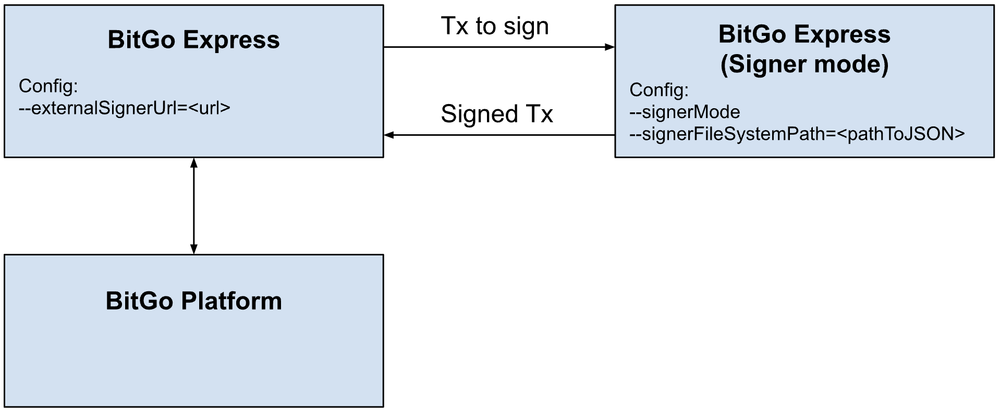

# BitGo Express External Signing Mode

BitGo Express can be run in an external signing mode, where the signing of transactions is performed in a separate instance of BitGo Express that has access to the private keys.
This may be preferable for users who would like to apply their signature to their transactions using a more secure environment than BitGo SDK or BitGo Express, such as a signer with restricted access or network connectivity.



### External signer mode setup

To set up BitGo Express with an external signer, a url to the external signer instance of BitGo Express must be provided using the `externalSignerUrl` configuration option.
The corresponding external signer instance of BitGo Express must have `signerMode` set, and `signerFileSystemPath` set to the path of a json containing the private key.
Note that if BitGo Express encounters an `ECONNREFUSED` error when requesting the external signer for a signature, it will retry the request for up to 15 seconds.

### Encrypted private key format

The JSON file containing the unencrypted private key(s) must be in the format `"<walletId>": "<encryptedPrivateKey>"`. Note that the `encryptedPrivateKey` must contain escape characters for the double quotations(`"`) in order for it to be parsed correctly.
Here is an example json file containing two wallet IDs and their corresponding encrypted private keys with escape characters:

```
{
"61f039aad587c2000745c687373e0fa9":"{\"iv\":\"+1u1Y9cvsYuRMeyH2slnXQ==\",\"v\":1,\"iter\":10000,\"ks\":256,\"ts\":64,\"mode\":\"ccm\",\"adata\":\"\",\"cipher\":\"aes\",\"salt\":\"54kOXTqJ9mc=\",\"ct\":\"JF5wQ82wa1dYyFxFlbHCvK4a+A6MTHdhOqc5uXsz2icWhkY2Lin/3Ab8ZwvwDaR1JYKmC/g1gXIGwVZEOl1M/bRHY420h7sDtmTS6Ebse5NWbF0ItfUJlk6HVATGa+C6mkbaVxJ4kQW/ehnT3riqzU069ATPz8E=\"}",
"61fb21819c54dd000755f8de3a18e46f":"{\"iv\":\"ULAkh1Ia2B2oJbVWRt+xMw==\",\"v\":1,\"iter\":10000,\"ks\":256,\"ts\":64,\"mode\":\"ccm\",\"adata\":\"\",\"cipher\":\"aes\",\"salt\":\"SVkVei5M1qU=\",\"ct\":\"NxfG1HQWGcrwCHkQh8DKeMaZrRic+SSBQHtuOSsSJzW5MDOpwqDta8PDdh52lp9eqtaY+CGN6rPhaGbeZDrEyV2PoBGeb48GicMTVAehkyoF9mr8edtsWDCxcmmde+1zv3czy2n/bgXYNGvX39D30GDRpfovSYc=\"}"
}
```

To help with the creation of this JSON file, we have created a file that will fetch the encrypted private keys from BitGo and produce a JSON file with the correct format (including the addition of escape characters).

The file is located at `src/fetchEncryptedPrivKeys.ts`. Before using this tool, you will need to either:

1. Fill in the `TODOs` by providing a valid `accessToken` as well as the list of `walletIds`, grouped by the cryptocurrency.
2. Using the same information as #1, update the .env file with the `accessToken` and `walletIds` information.

| Name                                      | Value  | Description                                    |
| ----------------------------------------- | ------ | ---------------------------------------------- |
| BITGO_EXTERNAL_SIGNER_ENV                 | string | test                                           |
| BITGO_EXTERNAL_SIGNER_ACCESS_TOKEN        | string | Access token used for access BitGo Wallets     |
| BITGO_EXTERNAL_SIGNER_WALLET_IDS          | string | JSON formatted string of wallets and their ids |
| BITGO_EXTERNAL_SIGNER_WALLET_IDS_WITH_PRV | string | JSON formatted string of wallets ids and       |
|                                           |        | their encrypted private keys                   |

BITGO_EXTERNAL_SIGNER_WALLET_IDS examples:

```
BITGO_EXTERNAL_SIGNER_WALLET_IDS={"tbtc":["xxx", "xxx"], "gteth": ["xxx"]}
BITGO_EXTERNAL_SIGNER_WALLET_IDS={"tbtc":[{"walletId":"xxx","walletPassword":"xxx","secret":"xxx"}]}
```

BITGO_EXTERNAL_SIGNER_WALLET_IDS_WITH_PRV examples:

```
BITGO_EXTERNAL_SIGNER_WALLET_IDS_WITH_PRV=[{"walletId":"xxx","encryptedPrv":"xxx"}]
```

Option #2 may make be more convenient for configuration instead of reconfiguring the file every time a new version is released both locally and to Docker.

An example is provided in the file. To run the file, use the command:

```sh
yarn ts-node <path/to/fetchEncryptedPrivKeys.ts>
```

### Wallet passphrase environment variable

In order for the external signer instance of BitGo Express to decrypt the private key, the wallet passphrase must be set as an environment variable in the format `WALLET_<walletId>_PASSPHRASE`. Note that the wallet passphrase must be set for each wallet.
The environment variable can be set using `export`. For example, the wallet passphrases for the private keys above can be set with the following:

```
export WALLET_61f039aad587c2000745c687373e0fa9_PASSPHRASE=wDX058%c4plL1@pP
export WALLET_61fb21819c54dd000755f8de3a18e46f_PASSPHRASE=wDX058%c4plL1@pP
```

### External signer mode configuration values

BitGo Express is able to take configuration options from either command line arguments, or via environment variables.

| Flag Short Name | Flag Long Name         | Environment Variable             | Default Value | Description                                                                                                                   |
| --------------- | ---------------------- | -------------------------------- | ------------- | ----------------------------------------------------------------------------------------------------------------------------- |
| N/A             | --externalSignerUrl    | `BITGO_EXTERNAL_SIGNER_URL`      | N/A           | URL specifying the external API to call for remote signing.                                                                   |
| N/A             | --signerMode           | `BITGO_SIGNER_MODE `             | N/A           | If set, run Express as a remote signer.                                                                                       |
| N/A             | --signerFileSystemPath | `BITGO_SIGNER_FILE_SYSTEM_PATH ` | N/A           | Local path specifying where an Express signer machine keeps the encrypted user private keys. Required when signerMode is set. |

#### Example

To start up an instance of BitGo Express that will use an external signer, start BitGo Express with `--externalSignerUrl=<externalSignerUrl>`.
To start up an external signing instance of BitGo Express, which will have access to the encrypted private keys and wallet passphrases, start BitGo Express with `--signerMode --signerFileSystemPath=<encryptedPrivateKeysJson>`.
